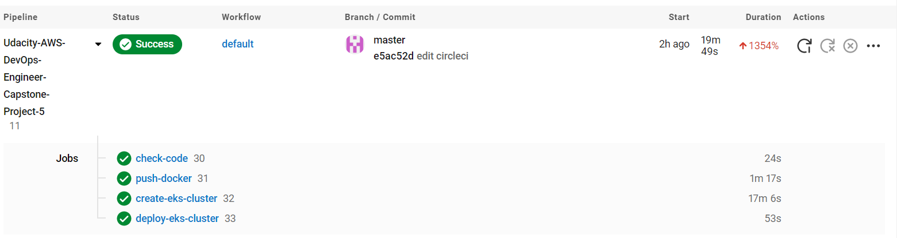
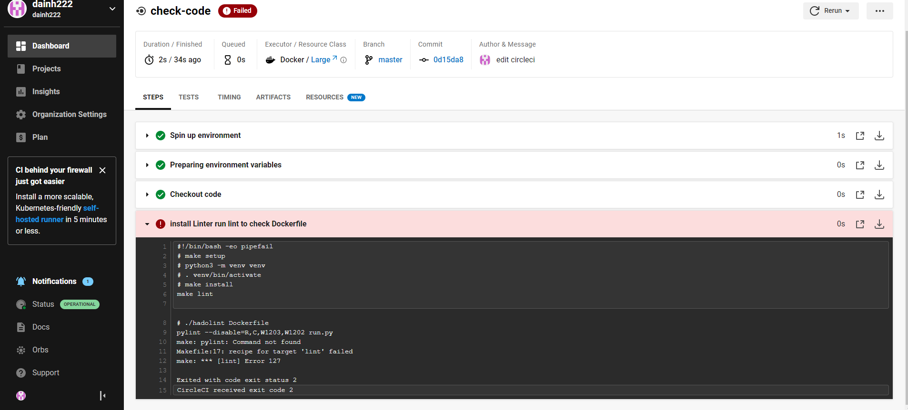
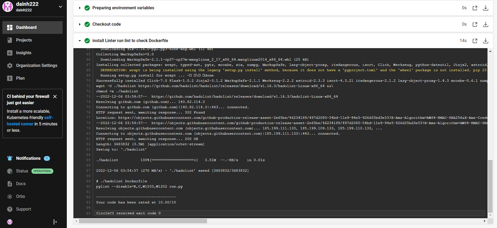
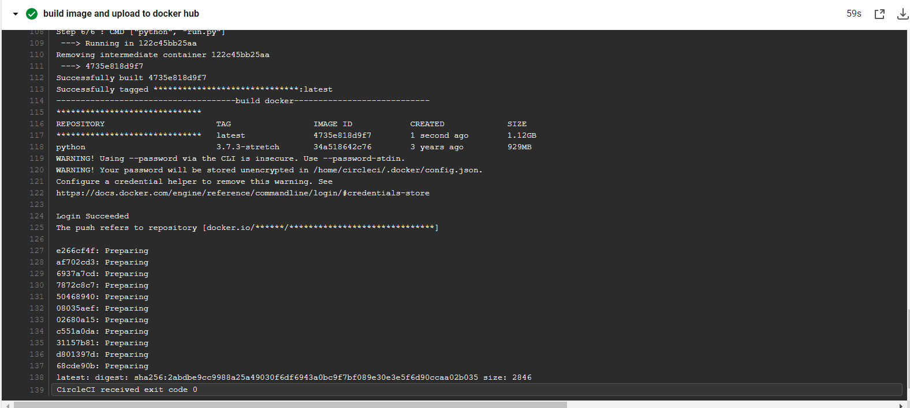
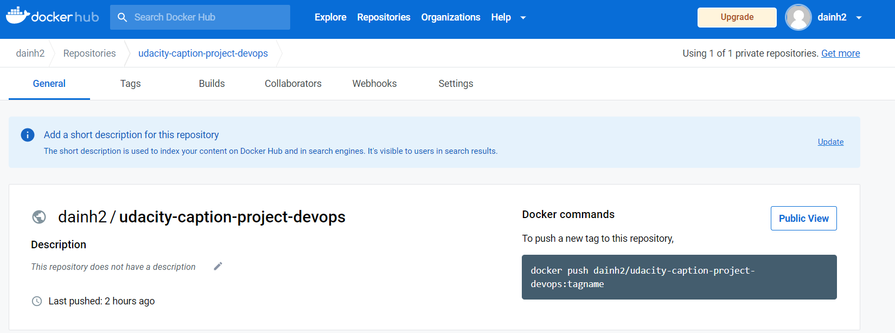
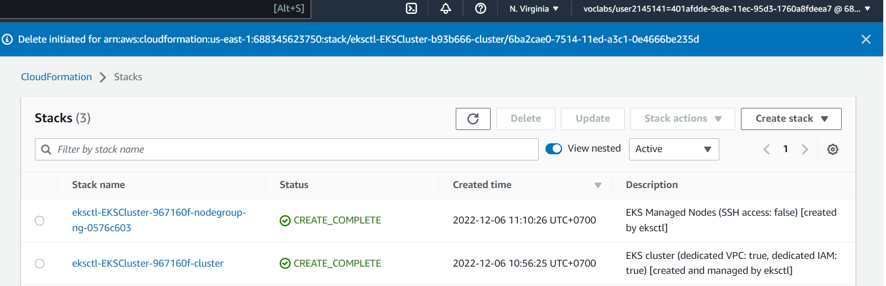
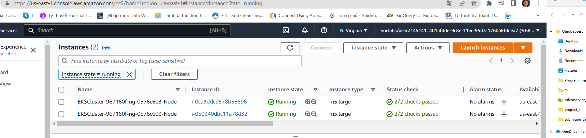
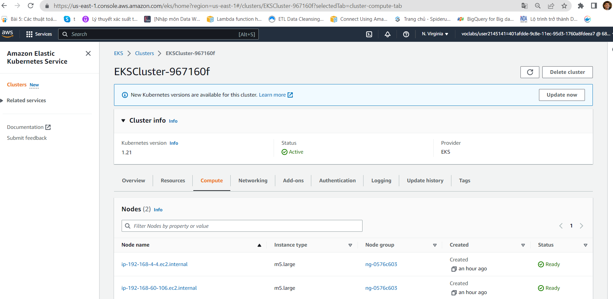

# Capstone Project (Cloud DevOps Engineer)

Capstone project for Udacity Dev-Ops Nanodegree: develop a CI/CD pipeline for micro services applications with either blue/green deployment or rolling deployment.

## CI CD Pipeline

The CI CD pipeline is as follows for this project. For initial set up:

- Set up CircleCI
- Install dependencies for local development
- Create AWS infrastructure

For application development:

- Make development change
- setup CircleCI
- Commit to git
- Push to repository

## Running the stuff

There is a `Makefile` that contains lots of useful commands.
Running `make` will list them, like the below output.

```text
setup:          Create the virtial environment to run this project
install:        Install the required imports for this project
test:           Run the tests for this prject
lint:           Check the validity of the project files
```


## CircleCI setup

Link CircleCI to project github
Add Enviroment on CircleCI 

## Output

From running the above the following will be created.

CIRCLECI FLOW:


CircleCI build when the lint fails:


CircleCI build when the lint pass:


Step build docker success


Step push image to docker hub:


Build stack on Cloudformation:


Create EC2 Success:


Create EKS Success:


<h3>Author</h3>
<a href = "https://github.com/dainh222/Udacity-AWS-DevOps-Engineer-Capstone-Project-5">GitHub</a>
